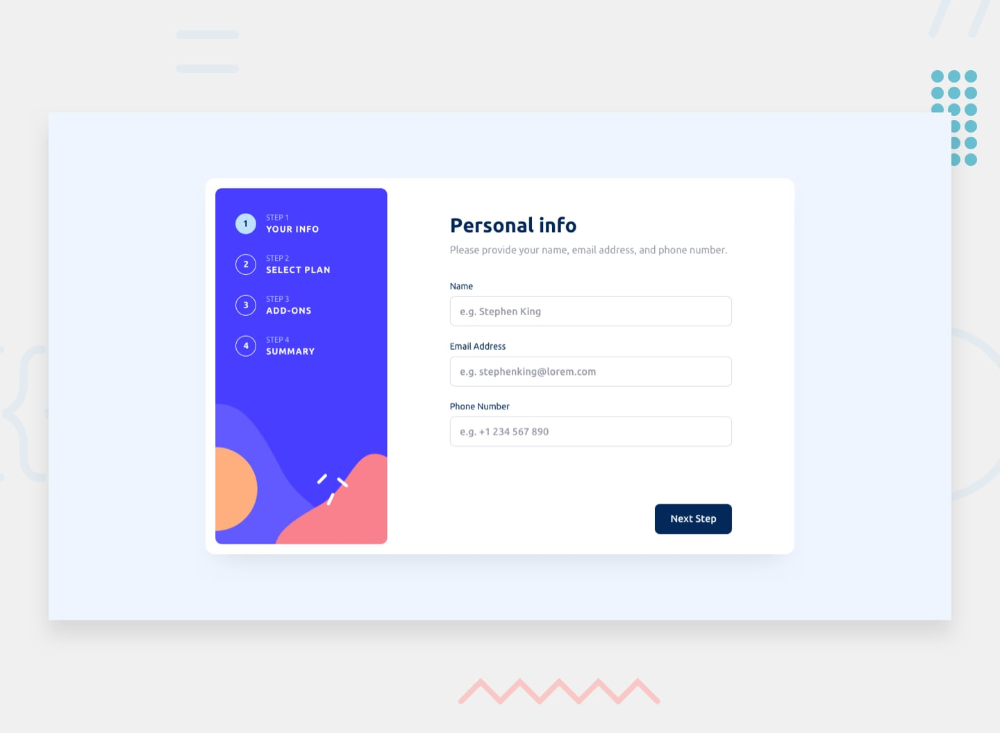

# Multi-step form
Desafio de nível avançado para construir um formulário com multiplas etapas, com validação de campos e tela adaptada para diferentes telas.



## 🔗 Links

-   Site: [link do deploy](https://RamonDSLOficial.github.io/Multi-step-form/)
-   Desafio original: [Frontend Mentor](https://www.frontendmentor.io/challenges/multistep-form-YVAnSdqQBJ)

## 🎯 Funcionalidades

-   Ver o layout ideal dependendo do tamanho da tela do dispositivo
-   Ver estados de hover para elementos interativos
-   Exibindo mensagens de validação de formulário
-   Utilização de boas práticas de acessibilidade
-   Alteração dos dados conforme modalidade selecionada
-   Mostrando resumo conforme itens do formulário selecionado


## 🛠️ Tecnologias

-   React
-   TypeScript
-   React Router Dom
-   Styled-components
-   React Hook Form
-   Zod

## 📚 O que aprendi
-   Criar formulários com Zod, e validar e controlar com React-Hook-Form, a partir do componente 'Controller', para controlar os inputs criados usando composite pattern e, utilizados em diferentes páginas gerenciadas pelo React-router-dom, ligados pelo FormProvider. 
-   Trabalhar com composite pattern na criação de componentes, permitindo reutlizar o mesmo componente em diferentes páginas, evitando duplicação de componentes e centralizando as regras e estilos comuns num único ponto.
-   Utilizar de transients props para controlar estilos dos componentes.
-   Utilizar atributos aria, tags semânticas e outros atributos para melhorar a acessibilidade da aplicação.

## 🚀 Como rodar o projeto

```bash
git clone https://github.com/RamonDSLOficial/Multi-step-form.git
cd seu-repo
npm install
npm run dev
```

## 👤 Autor

-   GitHub - [@RamonDSLOficial](https://github.com/RamonDSLOficial)